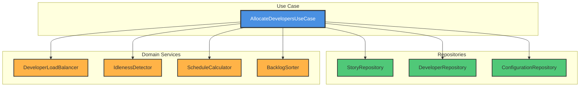
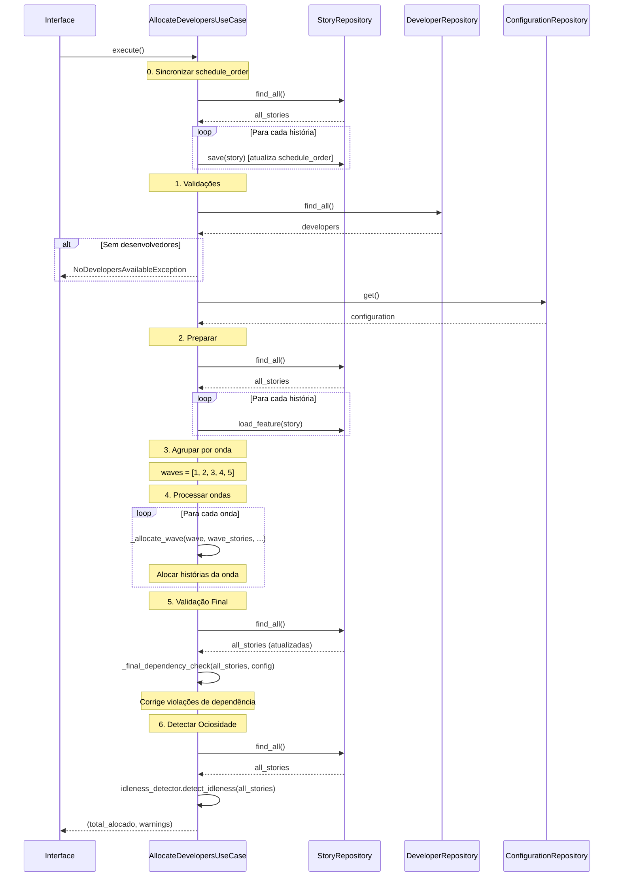
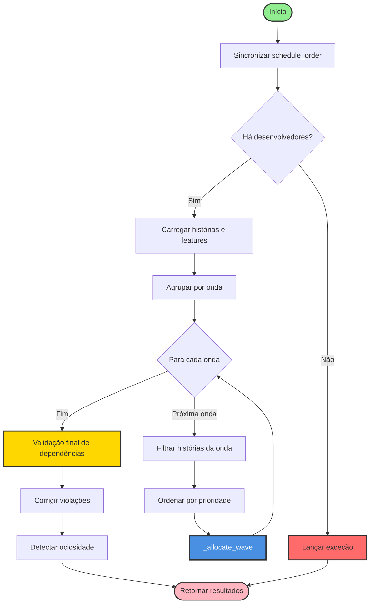
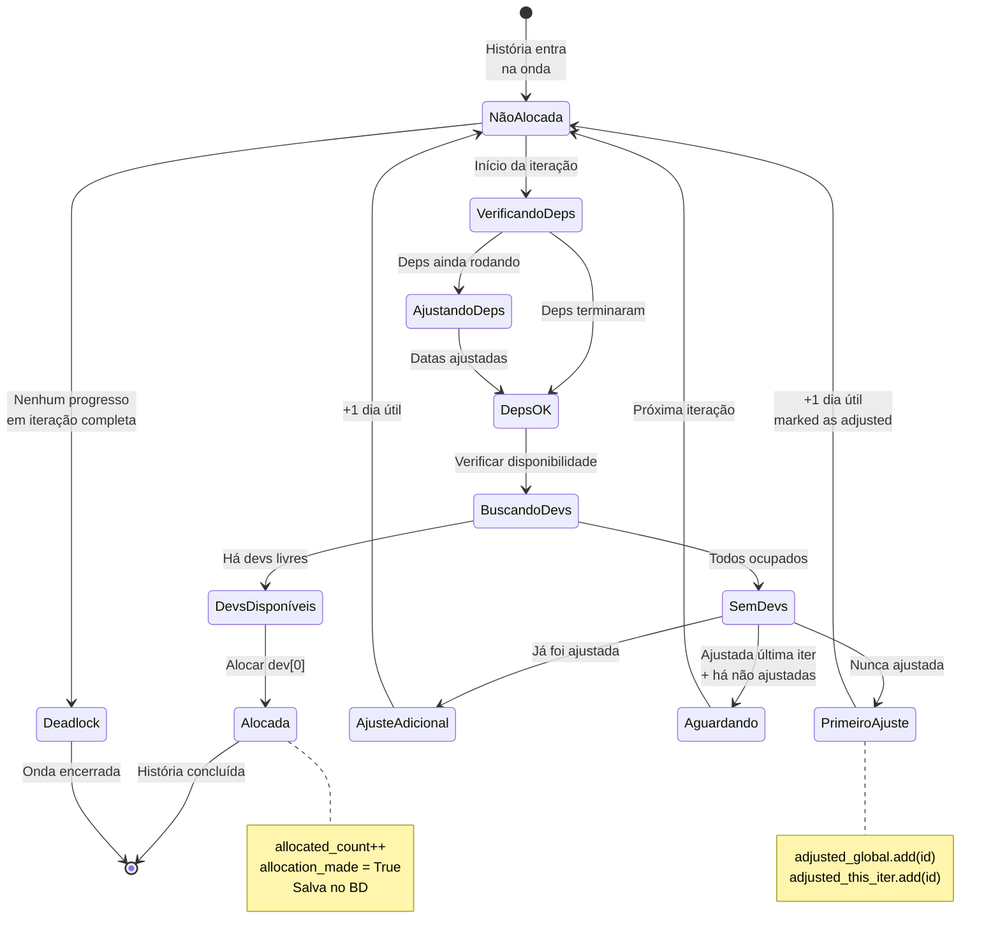
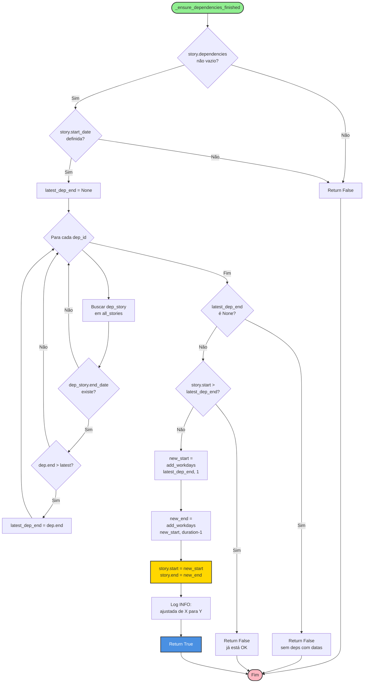
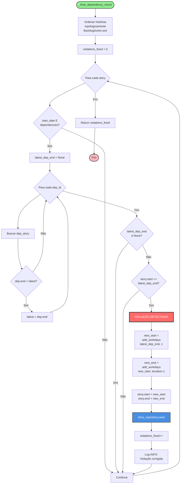
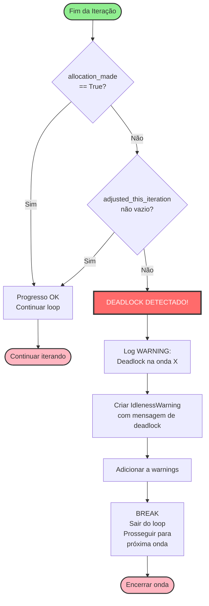
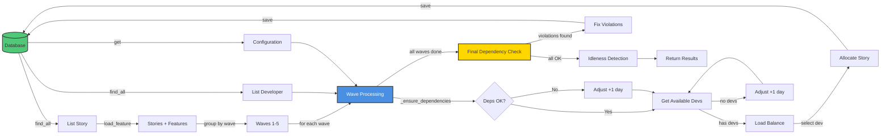

# Algoritmo de Alocação Automática de Desenvolvedores

## Sumário
- [1. Visão Geral](#1-visão-geral)
  - [1.2 Pré-requisitos e Pré-condições](#12-pré-requisitos-e-pré-condições)
  - [1.4 Parâmetros de Configuração](#14-parâmetros-de-configuração)
- [2. Arquitetura do Algoritmo](#2-arquitetura-do-algoritmo)
- [3. Fluxo Principal (execute)](#3-fluxo-principal-execute)
  - [3.4 Sincronização de schedule_order](#34-sincronização-de-schedule_order)
- [4. Funções Auxiliares](#4-funções-auxiliares)
- [5. Alocação por Onda (_allocate_wave)](#5-alocação-por-onda-_allocate_wave)
- [6. Validação de Dependências](#6-validação-de-dependências)
- [7. Balanceamento de Carga](#7-balanceamento-de-carga)
- [8. Detecção de Deadlock](#8-detecção-de-deadlock)
- [9. Exemplos Práticos](#9-exemplos-práticos)
- [10. Análise de Complexidade](#10-análise-de-complexidade)
- [11. Casos Especiais e Edge Cases](#11-casos-especiais-e-edge-cases)
- [12. Troubleshooting](#12-troubleshooting)
- [13. Diagramas de Arquitetura](#13-diagramas-de-arquitetura)
- [14. Glossário](#14-glossário)
- [15. Referências](#15-referências)

---

## 1. Visão Geral

### 1.1 Objetivo
O algoritmo aloca desenvolvedores a histórias de usuário de forma automática, respeitando:
- **Ondas de entrega**: Histórias são agrupadas em ondas (releases incrementais)
- **Dependências**: Uma história só pode iniciar após suas dependências terminarem
- **Disponibilidade**: Desenvolvedores não podem ter histórias com períodos sobrepostos
- **Balanceamento**: Distribuição equilibrada de carga entre desenvolvedores
- **Prioridade**: Histórias são processadas por ordem de prioridade

### 1.2 Pré-requisitos e Pré-condições

Antes de executar o algoritmo de alocação, as seguintes condições **devem** ser satisfeitas:

| Pré-condição | Descrição | Verificação |
|--------------|-----------|-------------|
| **CalculateSchedule executado** | Todas as histórias devem ter `start_date`, `end_date` e `duration_in_days` calculados | `story.start_date is not None` |
| **Desenvolvedores cadastrados** | Pelo menos 1 desenvolvedor deve existir | `len(developers) > 0` |
| **Configuração válida** | `Configuration` deve existir com `velocity_per_day > 0` | `config.story_points_per_sprint > 0` |
| **Ondas definidas** | Cada história deve ter `wave` atribuído (1-5) | `story.wave is not None` |
| **Sem ciclos de dependência** | Grafo de dependências deve ser acíclico (DAG) | Validado por `CycleDetector` |

**Sequência de execução correta:**
```
1. Criar/importar histórias (CreateStoryUseCase ou ImportFromExcelUseCase)
2. Definir dependências (AddDependencyUseCase)
3. Calcular cronograma (CalculateScheduleUseCase) ← OBRIGATÓRIO ANTES
4. Alocar desenvolvedores (AllocateDevelopersUseCase) ← ESTE ALGORITMO
```

> ⚠️ **Importante:** Se `CalculateScheduleUseCase` não for executado antes, as histórias não terão datas calculadas e o algoritmo não funcionará corretamente.

### 1.3 Requisito Funcional
**RF-ALOC-001**: Alocação Automática com Processamento por Onda

### 1.4 Parâmetros de Configuração

O algoritmo utiliza os seguintes parâmetros (constantes e configuráveis):

| Parâmetro | Valor | Tipo | Descrição |
|-----------|-------|------|-----------|
| `MAX_ITERATIONS` | 1000 | Constante | Limite de iterações por onda para evitar loop infinito |
| `ADJUSTMENT_DAYS` | 1 | Constante | Dias úteis adicionados quando não há dev disponível |
| `story_points_per_sprint` | Configurável | BD | Pontos por sprint (usado no cálculo de velocidade) |
| `workdays_per_sprint` | Configurável | BD | Dias úteis por sprint |
| `roadmap_start_date` | Configurável | BD | Data de início do roadmap |

**Feriados considerados:** Lista completa de feriados nacionais brasileiros (2025-2026) definida em `ScheduleCalculator`. Veja seção de referências.

### 1.5 Componentes Principais



---

## 2. Arquitetura do Algoritmo

### 2.1 Estratégia Geral

O algoritmo implementa uma estratégia **híbrida** combinando:

1. **Processamento por Onda**: Garante que ondas anteriores sejam priorizadas
2. **Loop Iterativo com Ajuste**: Tenta alocar histórias, ajustando datas quando necessário
3. **Validação Final**: Re-verifica todas as dependências após alocação completa

### 2.2 Principais Inovações

| Característica | Descrição | Benefício |
|---------------|-----------|-----------|
| **Processamento por Onda** | Processa ondas sequencialmente (1, 2, 3...) | Alinhamento com entrega incremental |
| **Ajuste Incremental** | Ajusta datas +1 dia útil quando não há dev disponível | Evita conflitos sem recomputação completa |
| **Balanceamento Aleatório** | Desempate aleatório entre devs com mesma carga | Fairness e distribuição equilibrada |
| **Validação Final** | Re-verifica dependências após todas as alocações | Garante integridade mesmo com ajustes dinâmicos |
| **Detecção de Deadlock** | Identifica quando nenhuma história pode ser alocada | Evita loops infinitos |

---

## 3. Fluxo Principal (execute)

### 3.1 Diagrama de Sequência



### 3.2 Pseudocódigo

```python
def execute():
    # 0. SINCRONIZAR schedule_order
    all_stories = story_repository.find_all()
    for index, story in enumerate(all_stories):
        story.schedule_order = index
        story_repository.save(story)

    # 1. VALIDAÇÕES
    developers = developer_repository.find_all()
    if not developers:
        raise NoDevelopersAvailableException()

    config = configuration_repository.get()

    # 2. PREPARAR
    all_stories = story_repository.find_all()
    for story in all_stories:
        story_repository.load_feature(story)

    # 3. AGRUPAR POR ONDA
    waves = sorted(set(s.wave for s in all_stories))

    # 4. PROCESSAR ONDAS
    adjusted_stories_global = set()
    total_allocated = 0
    all_warnings = []

    for wave in waves:
        wave_stories = [s for s in all_stories if s.wave == wave]
        wave_stories.sort(key=lambda s: s.priority)

        allocated, warnings = _allocate_wave(
            wave, wave_stories, developers,
            all_stories, adjusted_stories_global, config
        )

        total_allocated += allocated
        all_warnings.extend(warnings)

    # 5. VALIDAÇÃO FINAL
    all_stories = story_repository.find_all()
    for story in all_stories:
        story_repository.load_feature(story)

    violations_fixed = _final_dependency_check(all_stories, config)

    # 6. DETECTAR OCIOSIDADE
    all_stories = story_repository.find_all()
    idleness_warnings = idleness_detector.detect_idleness(all_stories)
    all_warnings.extend(idleness_warnings)

    return total_allocated, all_warnings
```

### 3.3 Fluxograma Simplificado



### 3.4 Sincronização de schedule_order

O `schedule_order` é um atributo da entidade `Story` que define a **ordem de exibição** das histórias na interface gráfica (tabela principal).

**Por que sincronizar no início da alocação?**

| Problema | Solução |
|----------|---------|
| Histórias podem ser reordenadas manualmente pelo usuário | Sincronizar `schedule_order` com a ordem de prioridade garante consistência |
| Após alocação, a UI precisa mostrar histórias na ordem correta | `schedule_order` é usado como critério de ordenação na tabela |
| Operações de drag-and-drop podem causar gaps nos índices | Re-indexação sequencial (0, 1, 2, ...) elimina gaps |

**Implementação:**
```python
# Sincronizar schedule_order antes de processar
all_stories = story_repository.find_all()  # Já vem ordenado por priority
for index, story in enumerate(all_stories):
    story.schedule_order = index
    story_repository.save(story)
```

**Relação com prioridade:**
- `priority`: Define a ordem de processamento do algoritmo (menor = primeiro)
- `schedule_order`: Define a ordem de exibição na UI (baseado em priority após sincronização)

> **Nota:** Esta sincronização é executada **uma única vez** no início do `execute()`, antes de qualquer alocação.

---

## 4. Funções Auxiliares

Esta seção documenta as funções auxiliares críticas usadas pelo algoritmo de alocação.

### 4.1 _get_available_developers

Filtra desenvolvedores que estão disponíveis para uma história específica (sem conflito de período).

**Assinatura:**
```python
def _get_available_developers(
    story: Story,
    all_stories: List[Story],
    developers: List[Developer]
) -> List[Developer]
```

**Diagrama de Fluxo:**

```mermaid
flowchart TD
    Start([_get_available_developers]) --> CheckDates{story.start_date<br/>e end_date<br/>definidos?}
    CheckDates -->|Não| ReturnAll[Retornar todos os devs]

    CheckDates -->|Sim| InitList[available = []]
    InitList --> LoopDevs{Para cada dev}

    LoopDevs --> FilterStories[Filtrar histórias<br/>alocadas a este dev]
    FilterStories --> CheckConflict{Há conflito<br/>de período?}

    CheckConflict -->|Não| AddDev[Adicionar dev<br/>a available]
    CheckConflict -->|Sim| NextDev[Próximo dev]
    AddDev --> NextDev
    NextDev --> LoopDevs

    LoopDevs -->|Fim| Return[Retornar available]
    ReturnAll --> End([Fim])
    Return --> End

    style Start fill:#90EE90,stroke:#333,stroke-width:2px
    style End fill:#FFB6C1,stroke:#333,stroke-width:2px
    style CheckConflict fill:#FFD700,stroke:#333,stroke-width:2px
```

**Critério de Conflito (Sobreposição de Períodos):**

Dois períodos `[A.start, A.end]` e `[B.start, B.end]` **sobrepõem** se:
```
A.start <= B.end AND A.end >= B.start
```

**Exemplo visual:**
```
Dev-A ocupado:    |----H1----|
                  Jan-10     Jan-15

Nova história H2: Tenta alocar de Jan-12 a Jan-14
                       |--H2--|
                       Jan-12 Jan-14

Resultado: CONFLITO (sobreposição)
           Dev-A NÃO está disponível para H2
```

### 4.2 _adjust_story_dates

Ajusta as datas de uma história em N dias úteis para frente.

**Assinatura:**
```python
def _adjust_story_dates(
    story: Story,
    days: int,
    config: Configuration
) -> None
```

**Comportamento:**
1. Calcula novo `start_date` = `add_workdays(story.start_date, days)`
2. Calcula novo `end_date` = `add_workdays(new_start_date, story.duration_in_days - 1)`
3. Atualiza `story.start_date` e `story.end_date`

**Dias Úteis:**
- Considera apenas segunda a sexta
- Exclui feriados brasileiros definidos em `ScheduleCalculator`

### 4.3 add_workdays

Função utilitária do `ScheduleCalculator` que adiciona N dias úteis a uma data.

**Assinatura:**
```python
def add_workdays(
    start_date: date,
    days: int
) -> date
```

**Comportamento:**
```python
# Pseudocódigo
current = start_date
remaining = days

while remaining > 0:
    current = current + 1 dia
    if is_workday(current):  # Não é fim de semana nem feriado
        remaining -= 1

return current
```

**Exemplo:**
```
add_workdays(2026-01-09 (sexta), 1) → 2026-01-12 (segunda)
add_workdays(2026-01-12 (segunda), 3) → 2026-01-15 (quinta)
```

---

## 5. Alocação por Onda (_allocate_wave)

### 5.1 Objetivo

Alocar todas as histórias de uma onda específica, ajustando datas quando necessário para evitar conflitos de disponibilidade de desenvolvedores.

> **Funções utilizadas:** Esta seção utiliza as funções documentadas em [4. Funções Auxiliares](#4-funções-auxiliares), especialmente `_get_available_developers` e `_adjust_story_dates`.

### 5.2 Tabela de Decisão

A tabela abaixo resume a lógica de decisão para cada história durante a alocação:

| Deps OK? | Devs Disponíveis? | Já Ajustada? | Ajustada Última Iter? | Há Não-Ajustadas? | Ação |
|:--------:|:-----------------:|:------------:|:--------------------:|:-----------------:|------|
| ❌ | - | - | - | - | Ajustar datas para após dependências |
| ✅ | ✅ | - | - | - | **ALOCAR** dev com menor carga |
| ✅ | ❌ | ❌ | - | - | Ajustar +1 dia, marcar como ajustada |
| ✅ | ❌ | ✅ | ❌ | - | Ajustar +1 dia |
| ✅ | ❌ | ✅ | ✅ | ✅ | **SKIP** (pular para próxima) |
| ✅ | ❌ | ✅ | ✅ | ❌ | Ajustar +1 dia |

**Legenda:**
- **Deps OK?**: Todas as dependências da história já terminaram?
- **Devs Disponíveis?**: Há pelo menos um desenvolvedor sem conflito de período?
- **Já Ajustada?**: A história já teve suas datas ajustadas em algum momento?
- **Ajustada Última Iter?**: Foi ajustada na iteração imediatamente anterior?
- **Há Não-Ajustadas?**: Existem outras histórias na onda que ainda não foram ajustadas?

**Detecção de Deadlock:**
```
Se ao final de uma iteração completa:
  - allocation_made = False (nenhuma alocação)
  - adjusted_this_iteration = {} (nenhum ajuste)
→ DEADLOCK! Encerrar onda e gerar warning.
```

### 5.3 Diagrama de Fluxo Detalhado

```mermaid
flowchart TD
    Start([Início _allocate_wave]) --> InitVars[Inicializar variáveis<br/>allocated_count = 0<br/>adjusted_last_iteration = ∅]

    InitVars --> LoopIter{Iteração < 1000?}
    LoopIter -->|Não| MaxIter[Limite de iterações<br/>atingido]
    MaxIter --> Return

    LoopIter -->|Sim| GetUnalloc[Buscar histórias<br/>não alocadas da onda]
    GetUnalloc --> CheckEmpty{Lista vazia?}
    CheckEmpty -->|Sim| Return[Retornar<br/>allocated_count, warnings]

    CheckEmpty -->|Não| InitFlags[allocation_made = False<br/>adjusted_this_iteration = ∅]
    InitFlags --> LoopStories{Para cada história}

    LoopStories --> CheckDeps[_ensure_dependencies_finished]
    CheckDeps --> DepsAdjusted{Ajustou datas?}
    DepsAdjusted -->|Sim| SaveDeps[Salvar história]
    DepsAdjusted -->|Não| GetAvailDevs
    SaveDeps --> GetAvailDevs[Buscar desenvolvedores<br/>disponíveis]

    GetAvailDevs --> HasDevs{Há devs<br/>disponíveis?}

    HasDevs -->|Sim| SortDevs[Ordenar devs por carga<br/>desempate aleatório]
    SortDevs --> SelectDev[Selecionar dev[0]]
    SelectDev --> AllocDev[story.allocate_developer]
    AllocDev --> SaveStory[Salvar história]
    SaveStory --> IncCount[allocated_count++<br/>allocation_made = True]
    IncCount --> BreakLoop[Break<br/>reiniciar loop]
    BreakLoop --> LoopIter

    HasDevs -->|Não| CheckAdjusted{Já foi ajustada<br/>alguma vez?}

    CheckAdjusted -->|Não| AdjustFirst[Ajustar datas +1 dia<br/>Adicionar a adjusted_global<br/>Adicionar a adjusted_this_iteration]
    AdjustFirst --> SaveAdjusted[Salvar história]
    SaveAdjusted --> NextStory

    CheckAdjusted -->|Sim| CheckLastIter{Ajustada na<br/>última iteração?}
    CheckLastIter -->|Sim e há não ajustadas| Skip[Continue<br/>pular para próxima]
    CheckLastIter -->|Não ou só ajustadas| AdjustAgain[Ajustar datas +1 dia<br/>Adicionar a adjusted_this_iteration]
    AdjustAgain --> SaveAdjusted
    Skip --> NextStory

    NextStory --> LoopStories

    LoopStories -->|Fim do loop| UpdateFlags[adjusted_last_iteration =<br/>adjusted_this_iteration.copy]
    UpdateFlags --> CheckDeadlock{allocation_made?<br/>OU<br/>ajustes feitos?}

    CheckDeadlock -->|Não| Deadlock[DEADLOCK!<br/>Criar warning<br/>Break]
    Deadlock --> Return

    CheckDeadlock -->|Sim| LoopIter

    style Start fill:#90EE90,stroke:#333,stroke-width:2px
    style Return fill:#FFB6C1,stroke:#333,stroke-width:2px
    style Deadlock fill:#FF6B6B,stroke:#333,stroke-width:3px,color:#fff
    style AllocDev fill:#4A90E2,stroke:#333,stroke-width:2px,color:#fff
    style CheckDeps fill:#FFD700,stroke:#333,stroke-width:2px
```

### 5.4 Máquina de Estados de uma História



### 5.5 Exemplo de Execução (Onda 2)

**Cenário:**
- Onda 2 tem 3 histórias: H1 (5 pts), H2 (8 pts), H3 (3 pts)
- 2 desenvolvedores: Dev-A, Dev-B
- H1 depende de histórias da Onda 1 que terminam em 2026-01-10

**Iteração 1:**
```
História H1:
  - _ensure_dependencies_finished: ajusta H1.start de 2026-01-08 → 2026-01-11
  - _get_available_developers: Dev-A e Dev-B disponíveis
  - Alocar H1 para Dev-A (menor carga)
  - allocated_count = 1, allocation_made = True
  - BREAK (reinicia loop)
```

**Iteração 2:**
```
História H2:
  - _ensure_dependencies_finished: sem ajustes
  - _get_available_developers: Dev-A ocupado (H1), Dev-B disponível
  - Alocar H2 para Dev-B
  - allocated_count = 2, allocation_made = True
  - BREAK
```

**Iteração 3:**
```
História H3:
  - _ensure_dependencies_finished: sem ajustes
  - _get_available_developers: Dev-A e Dev-B ocupados
  - Ajustar H3.start +1 dia
  - adjusted_global = {H3}, adjusted_this_iteration = {H3}
  - allocation_made = False
  - FIM DO LOOP (sem break)
```

**Iteração 4:**
```
História H3 (ajustada):
  - _ensure_dependencies_finished: sem ajustes
  - _get_available_developers: Dev-A disponível (H1 terminou)
  - Alocar H3 para Dev-A
  - allocated_count = 3, allocation_made = True
  - BREAK
```

**Iteração 5:**
```
Unallocated_stories = [] (vazia)
RETORNAR: allocated_count=3, warnings=[]
```

---

## 6. Validação de Dependências

Esta seção detalha os mecanismos de validação que garantem que histórias só iniciem após suas dependências serem concluídas.

> **Relacionado:** [4.3 add_workdays](#43-add_workdays) | [5. Alocação por Onda](#5-alocação-por-onda-_allocate_wave) | [11. Casos Especiais](#11-casos-especiais-e-edge-cases)

### 6.1 _ensure_dependencies_finished (Durante Alocação)

Executado **antes** de cada tentativa de alocação para garantir que a história só inicia após suas dependências terminarem.



### 6.2 _final_dependency_check (Após Todas as Ondas)

Executado **uma única vez** após todas as ondas serem processadas. Garante que nenhuma violação passou despercebida.



### 6.3 Por Que Precisamos de Validação Final?

**Problema:**
Durante o processamento por onda, uma história pode ser ajustada para respeitar suas dependências, mas se as próprias dependências tiverem suas datas ajustadas **posteriormente** (devido a conflitos de desenvolvedores), a história dependente não é re-verificada.

**Exemplo:**

```
Onda 1:
  - L4 inicia com datas calculadas: 2026-01-08 a 2026-01-10
  - Durante alocação, não há dev disponível
  - L4 é ajustada para: 2026-01-15 a 2026-01-20
  - L4 é alocada

Onda 3:
  - A1 depende de L4
  - _ensure_dependencies_finished vê L4.end_date = 2026-01-20
  - A1 é ajustada para iniciar em 2026-01-21
  - Durante alocação de A1, há conflito
  - A1 é ajustada para 2026-01-22
  - Porém, APÓS isso, outro dev fica livre em 2026-01-08
  - Se L4 já está alocada, está OK
  - MAS se houver outra história na Onda 1 que ainda não foi alocada e causa L4 ser re-ajustada...

  Na prática, histórias já alocadas NÃO mudam. Mas pode haver:
  - Erro de lógica durante ajustes
  - All_stories não refletir estado atual
  - Ajustes múltiplos causarem inconsistência
```

**Solução:**
A validação final recarrega **todas** as histórias do banco de dados (estado final após todas as ondas) e re-verifica **todas** as dependências em ordem topológica, garantindo integridade absoluta.

---

## 7. Balanceamento de Carga

O balanceamento de carga garante distribuição equilibrada de story points entre desenvolvedores.

> **Relacionado:** [5. Alocação por Onda](#5-alocação-por-onda-_allocate_wave) | [4.1 _get_available_developers](#41-_get_available_developers)

### 7.1 DeveloperLoadBalancer

O `DeveloperLoadBalancer` é um serviço de domínio que ordena desenvolvedores por carga de trabalho.

```mermaid
flowchart TD
    Start([sort_by_load_random_tiebreak]) --> CalcLoads[Calcular carga de cada dev]

    CalcLoads --> LoopDevs{Para cada dev}
    LoopDevs --> FilterStories[Filtrar histórias<br/>alocadas a este dev]
    FilterStories --> SumPoints[Somar story_points]
    SumPoints --> StoreLoad[loads[dev] = total_points]
    StoreLoad --> LoopDevs

    LoopDevs -->|Fim| SortByLoad[Ordenar devs por carga<br/>ASC]
    SortByLoad --> GroupByLoad[Agrupar devs com<br/>mesma carga]

    GroupByLoad --> LoopGroups{Para cada grupo}
    LoopGroups --> CheckSize{Grupo tem<br/>> 1 dev?}
    CheckSize -->|Não| NextGroup
    CheckSize -->|Sim| Shuffle[random.shuffle<br/>grupo]
    Shuffle --> NextGroup[Próximo grupo]
    NextGroup --> LoopGroups

    LoopGroups -->|Fim| FlattenList[Achatar lista<br/>de grupos]
    FlattenList --> Return[Return devs ordenados]
    Return --> End([Fim])

    style Start fill:#90EE90,stroke:#333,stroke-width:2px
    style End fill:#FFB6C1,stroke:#333,stroke-width:2px
    style Shuffle fill:#FFD700,stroke:#333,stroke-width:2px
```

### 7.2 Exemplo de Balanceamento

**Cenário Inicial:**
```
Dev-A: 13 pts (H1: 8, H2: 5)
Dev-B: 8 pts (H3: 8)
Dev-C: 8 pts (H4: 5, H5: 3)
Dev-D: 3 pts (H6: 3)
```

**História H7 (5 pts) precisa ser alocada:**

1. **Calcular cargas:**
   ```
   loads = {
     Dev-A: 13,
     Dev-B: 8,
     Dev-C: 8,
     Dev-D: 3
   }
   ```

2. **Ordenar por carga:**
   ```
   sorted_devs = [Dev-D(3), Dev-B(8), Dev-C(8), Dev-A(13)]
   ```

3. **Agrupar por carga:**
   ```
   grupos = [
     [Dev-D],        # carga 3
     [Dev-B, Dev-C], # carga 8
     [Dev-A]         # carga 13
   ]
   ```

4. **Desempate aleatório no grupo [Dev-B, Dev-C]:**
   ```
   random.shuffle([Dev-B, Dev-C])
   # Resultado possível: [Dev-C, Dev-B]
   ```

5. **Lista final:**
   ```
   devs_ordenados = [Dev-D, Dev-C, Dev-B, Dev-A]
   ```

6. **Selecionar dev[0]:**
   ```
   H7 é alocada para Dev-D
   ```

**Estado Final:**
```
Dev-A: 13 pts
Dev-B: 8 pts
Dev-C: 8 pts
Dev-D: 8 pts (H6: 3, H7: 5)  ← Balanceado!
```

---

## 8. Detecção de Deadlock

### 8.1 Condição de Deadlock

Um **deadlock** ocorre quando, em uma iteração completa do loop, **nenhuma** das seguintes ações acontece:
- Nenhuma história foi alocada (`allocation_made = False`)
- Nenhuma história teve suas datas ajustadas (`len(adjusted_this_iteration) == 0`)

Isso significa que o algoritmo está "preso" e não consegue fazer progresso.

### 8.2 Diagrama de Detecção



### 8.3 Exemplo de Deadlock

#### 8.3.1 Caso que NÃO é Deadlock (Resolução por Ajuste)

**Cenário:**
```
Onda 4: 2 histórias (H10, H11)
Desenvolvedores: 2 (Dev-A, Dev-B)

H10: start 2026-01-20, end 2026-01-22 (depende de H9 que termina 2026-01-25)
H11: start 2026-01-20, end 2026-01-21 (depende de H9)

Dev-A: ocupado até 2026-01-30
Dev-B: ocupado até 2026-01-30
```

**Execução resumida:**
```
Iterações 1-2: Ajustes sucessivos de +1 dia (nenhum dev disponível)
Iteração 3: H10 alcança 2026-01-30, Dev-A e Dev-B ficam livres → Aloca H10 para Dev-A
Iteração 4: H11 alocada para Dev-B
Resultado: SUCESSO (2 histórias alocadas, 0 deadlock)
```

#### 8.3.2 Caso de Deadlock REAL

**Cenário:**
```
Onda 3: 3 histórias (H7, H8, H9)
Desenvolvedores: 1 (Dev-A)

H7: 8 story points (duração: 4 dias), start 2026-01-20, end 2026-01-23
H8: 5 story points (duração: 3 dias), start 2026-01-20, end 2026-01-22
H9: 3 story points (duração: 2 dias), start 2026-01-20, end 2026-01-21

Dev-A: ÚNICA disponibilidade é 2026-01-20 a 2026-01-23 (4 dias)
       Após isso, Dev-A entra de férias indefinidamente
```

**Problema:** 3 histórias precisam do mesmo desenvolvedor no mesmo período, mas ele só pode trabalhar em uma por vez.

**Execução:**

```
Iteração 1:
  H7: _get_available_developers → [Dev-A] disponível
      Alocar H7 para Dev-A (2026-01-20 a 2026-01-23)
      allocated_count = 1, allocation_made = True
      BREAK

Iteração 2:
  H8: _get_available_developers → [] (Dev-A ocupado com H7)
      Ajustar H8 +1 dia: 2026-01-21 a 2026-01-23
      adjusted_this_iteration = {H8}

  H9: _get_available_developers → [] (Dev-A ocupado com H7)
      Ajustar H9 +1 dia: 2026-01-21 a 2026-01-22
      adjusted_this_iteration = {H8, H9}

  allocation_made = False, adjusted_this_iteration não vazio
  → Continuar

Iteração 3:
  H8: _get_available_developers → [] (Dev-A ocupado até 2026-01-23)
      Ajustar H8 +1 dia: 2026-01-22 a 2026-01-24
      MAS 2026-01-24 Dev-A está de férias!
      adjusted_this_iteration = {H8}

  H9: _get_available_developers → []
      Ajustar H9 +1 dia: 2026-01-22 a 2026-01-23
      adjusted_this_iteration = {H8, H9}

  allocation_made = False
  → Continuar

... (ajustes continuam, mas Dev-A nunca mais fica disponível) ...

Iteração N:
  H8: _get_available_developers → []
      Já foi ajustada na última iteração
      Há não-ajustadas? NÃO (H9 também foi ajustada)
      Tentar ajustar novamente... mas isso não muda o fato de que Dev-A não existe após 2026-01-23

  H9: mesmo problema

  allocation_made = False
  adjusted_this_iteration = {} ← VAZIO! (nenhum ajuste útil foi feito)

  ╔══════════════════════════════════════════════════════════╗
  ║  DEADLOCK DETECTADO!                                      ║
  ║  - allocation_made = False                                ║
  ║  - adjusted_this_iteration está vazio                     ║
  ║  - Nenhum progresso possível                              ║
  ╚══════════════════════════════════════════════════════════╝

  → Criar warning: "Deadlock na onda 3: 2 histórias não puderam ser alocadas"
  → BREAK (sair do loop da onda)
```

**Resultado Final:**
```
Onda 3:
  - H7: Alocada para Dev-A ✓
  - H8: NÃO alocada (sem desenvolvedor disponível) ✗
  - H9: NÃO alocada (sem desenvolvedor disponível) ✗

Warnings retornados:
  - IdlenessWarning: "Deadlock detectado na onda 3. Histórias não alocadas: H8, H9"
```

#### 8.3.3 Causas Comuns de Deadlock

| Causa | Descrição | Solução |
|-------|-----------|---------|
| **Poucos desenvolvedores** | Mais histórias que devs disponíveis no período | Adicionar desenvolvedores ou redistribuir ondas |
| **Períodos muito curtos** | Janela de alocação menor que duração das histórias | Estender roadmap ou reduzir story points |
| **Dependências bloqueantes** | Histórias dependem de outras que ocupam todos os devs | Revisar estrutura de dependências |
| **Férias/indisponibilidade** | Desenvolvedores indisponíveis em períodos críticos | Planejar considerando ausências |

> **Veja também:** [Seção 12. Troubleshooting](#12-troubleshooting) para diagnóstico e resolução de deadlocks.

---

## 9. Exemplos Práticos

### 9.1 Caso Completo: 5 Ondas, 40 Histórias, 5 Desenvolvedores

**Setup Inicial:**
```
Ondas:
  - Onda 1: 5 histórias (L1-L5)
  - Onda 2: 7 histórias (L6-L7, T1-T5)
  - Onda 3: 7 histórias (A1, T6-T11)
  - Onda 4: 4 histórias (B9, B10, N1, N2)
  - Onda 5: 17 histórias (B1-B8, N3-N9, L8, A2)

Desenvolvedores: AA, BB, CC, DD, EE

Dependências (exemplo):
  - A1 depende de L4, L5
  - T6 depende de L7
  - B6 depende de T6
  - B1 depende de T4
  - B2 depende de T3, T4
```

> **Nota:** Os IDs seguem o padrão `COMPONENTE + NÚMERO` (L=Login, T=Testes, A=API, B=Backend, N=Notificações).

**Execução (resumo dos logs reais):**

```
[INÍCIO]
Sincronizando schedule_order...
Encontrados 5 desenvolvedores disponíveis
Encontradas 5 ondas para processar: [1, 2, 3, 4, 5]

[ONDA 1]
Processando onda 1
Onda 1: 5 histórias a processar
  → L1 alocada para AA
  → L2 alocada para BB
  → L3 alocada para CC
  → L4 alocada para DD
  → L5 alocada para EE
Onda 1 concluída: 5 histórias alocadas

[ONDA 2]
Processando onda 2
Onda 2: 7 histórias a processar
  → L6 alocada para AA
  → L7 alocada para BB
  → T1 alocada para CC
  → T2 alocada para DD (sem ajuste de deps)
  → T3 alocada para EE
  → T4 alocada para AA
  → T5 alocada para BB
Onda 2 concluída: 7 histórias alocadas

[ONDA 3]
Processando onda 3
Onda 3: 7 histórias a processar
  → A1: ajustada de 2026-01-08 para 2026-01-09 (deps terminam 2026-01-08)
  → A1 alocada para CC
  → T6: ajustada de 2026-01-07 para 2026-01-08 (deps terminam 2026-01-07)
  → T6 alocada para DD
  → T7 alocada para EE
  → T8 alocada para AA
  → T9 alocada para BB
  → T10 alocada para CC
  → T11 alocada para DD
Onda 3 concluída: 7 histórias alocadas

[ONDA 4]
Processando onda 4
Onda 4: 4 histórias a processar
  → B9: ajustada de 2026-01-12 para 2026-01-15 (deps terminam 2026-01-14)
  → B9 alocada para EE
  → B10 alocada para AA
  → N1 alocada para BB
  → N2 alocada para CC
Onda 4 concluída: 4 histórias alocadas

[ONDA 5]
Processando onda 5
Onda 5: 17 histórias a processar
  → N5: ajustada de 2026-01-06 para 2026-01-19 (deps terminam 2026-01-16)
  → N5 alocada para DD
  → B1: ajustada de 2026-01-08 para 2026-01-23 (deps terminam 2026-01-22)
  → B1 alocada para EE
  → B2: ajustada de 2026-01-09 para 2026-01-23 (deps terminam 2026-01-22)
  → B2 alocada para AA
  → ... (continua)
Onda 5 concluída: 17 histórias alocadas

[VALIDAÇÃO FINAL]
Validação final: verificando dependências
  → Violação corrigida: A1 ajustada de 2026-01-09 para 2026-01-21 (dep termina 2026-01-20)
  → Violação corrigida: T6 ajustada de 2026-01-12 para 2026-01-21 (dep termina 2026-01-20)
  → Violação corrigida: B9 ajustada de 2026-01-16 para 2026-01-26 (dep termina 2026-01-23)
  → Violação corrigida: B6 ajustada de 2026-01-19 para 2026-01-26 (dep termina 2026-01-23)
  → Violação corrigida: B1 ajustada de 2026-01-23 para 2026-02-04 (dep termina 2026-02-03)
  → Violação corrigida: B2 ajustada de 2026-01-23 para 2026-02-04 (dep termina 2026-02-03)
Validação final: 6 histórias ajustadas para respeitar dependências

[DETECÇÃO DE OCIOSIDADE]
Detectando períodos de ociosidade
  → 11 warnings de ociosidade detectados

[CONCLUSÃO]
Alocação concluída: 40 histórias alocadas, 11 warnings detectados
```

**Por Que Violações Ocorreram?**

As histórias foram ajustadas durante o processamento da onda para respeitar dependências, mas quando as próprias dependências tiveram suas datas ajustadas posteriormente (devido a conflitos de disponibilidade), as histórias dependentes não foram re-verificadas. A validação final detectou e corrigiu essas inconsistências.

---

## 10. Análise de Complexidade

### 10.1 Complexidade de Tempo

Seja:
- `n` = número total de histórias
- `w` = número de ondas
- `d` = número de desenvolvedores
- `e` = número de dependências (arestas no grafo)
- `i_max` = número máximo de iterações por onda (limitado a 1000)
- `h_w` = número de histórias na onda w

#### execute()
```
1. Sincronizar schedule_order: O(n log n)
   - find_all: O(n)
   - Para cada história save: O(n)

2. Buscar desenvolvedores: O(d)

3. Carregar features: O(n)

4. Agrupar por onda: O(n)

5. Para cada onda: O(w)
   - Filtrar histórias: O(n)
   - Ordenar por prioridade: O(h_w log h_w)
   - _allocate_wave: O(i_max × h_w × (d + n))

   Total por onda: O(h_w log h_w + i_max × h_w × (d + n))
   Total todas as ondas: O(w × h_w log h_w + i_max × n × (d + n))

   Simplificando (assumindo h_w ≈ n/w):
   = O(n log(n/w) + i_max × n × (d + n))
   = O(n log n + i_max × n × d + i_max × n²)

6. Validação final: O(n + e)
   - Ordenação topológica: O(n + e)
   - Para cada história: O(n × d_avg)
     onde d_avg = número médio de dependências por história
   Total: O(n + e + n × d_avg) = O(n × d_avg + e)

7. Detecção de ociosidade: O(n × d)

COMPLEXIDADE TOTAL:
O(n log n + i_max × n × d + i_max × n² + n × d_avg + e + n × d)

No pior caso (i_max constante, d_avg constante):
= O(n² + n × d + e)
```

**Na prática:**
- `i_max` é tipicamente pequeno (< 10 iterações por onda na maioria dos casos)
- `d` é pequeno (5-20 desenvolvedores)
- `d_avg` é pequeno (1-5 dependências por história)
- Portanto, a complexidade efetiva é **O(n²)** no pior caso, mas **O(n × d)** no caso médio

### 10.2 Complexidade de Espaço

```
1. all_stories: O(n)
2. developers: O(d)
3. adjusted_stories_global: O(n) no pior caso
4. waves: O(w)
5. wave_stories: O(h_w) por onda

TOTAL: O(n + d + w) = O(n)
```

### 10.3 Otimizações Aplicadas

| Otimização | Benefício |
|-----------|-----------|
| **Processamento por onda** | Reduz espaço de busca em cada iteração de O(n) para O(h_w) |
| **Break após alocação** | Evita processar histórias já alocadas na mesma iteração |
| **Flag de ajuste** | Evita ajustar mesma história múltiplas vezes seguidas |
| **Cache de features** | Carrega features uma vez no início, não em cada verificação |
| **Ordenação topológica na validação final** | Garante que dependências sejam verificadas antes de dependentes |

---

## 11. Casos Especiais e Edge Cases

Esta seção documenta comportamentos em situações atípicas e casos de borda.

> **Relacionado:** [8. Detecção de Deadlock](#8-detecção-de-deadlock) | [12. Troubleshooting](#12-troubleshooting)

### 11.1 História Sem Dependências

**Comportamento:**
- `_ensure_dependencies_finished` retorna `False` imediatamente
- História é processada normalmente para alocação
- Pode ser alocada na primeira tentativa se houver dev disponível

### 11.2 História Com Dependências Circulares

**Prevenção:**
- Validado em `AddDependencyUseCase` usando `CycleDetector`
- Nunca chega ao algoritmo de alocação
- Se ocorrer (erro de dados), `BacklogSorter` detecta e lança exceção

### 11.3 Todos os Desenvolvedores Ocupados

**Cenário:**
```
História H precisa ser alocada de 2026-01-20 a 2026-01-22
Todos os devs estão ocupados nesse período
```

**Comportamento:**
```
Iteração 1:
  - _get_available_developers retorna []
  - Ajustar H +1 dia: 2026-01-21 a 2026-01-23
  - Marcar como ajustada

Iteração 2:
  - _get_available_developers retorna []
  - Ajustar H +1 dia: 2026-01-22 a 2026-01-24

... (continua ajustando até encontrar janela livre)
```

Se **nunca** houver janela livre: **Deadlock** detectado e onda é encerrada.

### 11.4 Dependência Não Alocada

**Cenário:**
```
A1 depende de L4
L4 está na Onda 1, mas não foi alocada (deadlock na Onda 1)
A1 está na Onda 3
```

**Comportamento:**
```
_ensure_dependencies_finished:
  - Busca L4 em all_stories
  - L4.end_date pode ser None (não alocada = sem datas ajustadas finais)
  - Se L4.end_date is None: latest_dep_end permanece None
  - Retorna False (sem ajuste)

_get_available_developers:
  - Usa A1.start_date original (do CalculateSchedule)
  - Tenta alocar normalmente
```

**Problema potencial:** A1 pode ser alocada com datas que não respeitam L4 se L4 for alocada depois.

**Solução:** Validação final detecta e corrige.

### 11.5 História Com Múltiplas Dependências

**Cenário:**
```
B2 depende de T3 (termina 2026-01-20) e T4 (termina 2026-01-22)
B2.start original: 2026-01-15
```

**Comportamento:**
```
_ensure_dependencies_finished:
  - Itera sobre [T3, T4]
  - T3.end_date = 2026-01-20 → latest_dep_end = 2026-01-20
  - T4.end_date = 2026-01-22 → latest_dep_end = 2026-01-22 (maior)
  - Ajusta B2 para iniciar em 2026-01-23 (após a ÚLTIMA dependência)
```

### 11.6 Onda Vazia

**Cenário:**
```
Onda 3 não tem nenhuma história (todas foram deletadas ou movidas)
```

**Comportamento:**
```
execute():
  - waves = sorted(set(s.wave for s in all_stories))
  - Se Onda 3 não tem histórias, não aparece em waves
  - Onda 3 é pulada automaticamente
```

### 11.7 Limite de Iterações Atingido

**Cenário:**
```
Loop em _allocate_wave chega a 1000 iterações
```

**Comportamento:**
```
for iteration in range(1000):
    ...
    # Após 1000 iterações, loop termina

# Retorna allocated_count (histórias alocadas até agora)
# Histórias não alocadas ficam sem desenvolvedor
```

**Na prática:** Extremamente raro. Tipicamente 2-10 iterações por onda.

### 11.8 História Ajustada Múltiplas Vezes

**Cenário:**
```
H10 precisa ser ajustada 5 vezes até encontrar janela livre
```

**Comportamento:**
```
Iteração 1: Ajusta +1 dia, marca como ajustada
Iteração 2: Ajusta +1 dia (já estava ajustada)
Iteração 3: Ajusta +1 dia
...
Iteração 5: Dev fica disponível, aloca H10
```

**Não há limite** para número de ajustes. História continua sendo ajustada até:
- Encontrar dev disponível
- Deadlock ser detectado

### 11.9 Desenvolvedores Com Cargas Iguais

**Cenário:**
```
Dev-A: 8 pts
Dev-B: 8 pts
Dev-C: 8 pts
```

**Comportamento:**
```
DeveloperLoadBalancer.sort_by_load_random_tiebreak:
  - Agrupa [Dev-A, Dev-B, Dev-C]
  - random.shuffle([Dev-A, Dev-B, Dev-C])
  - Resultado aleatório: por exemplo [Dev-C, Dev-A, Dev-B]

História H é alocada para Dev-C (primeiro do grupo embaralhado)
```

**Benefício:** Distribuição justa ao longo de múltiplas execuções.

### 11.10 História com wave = None

**Cenário:**
```
História H15 foi criada mas não teve onda atribuída (wave = None)
```

**Comportamento:**
```python
execute():
  # Agrupar por onda
  waves = sorted(set(s.wave for s in all_stories if s.wave is not None))

  # H15 com wave=None:
  #   - NÃO aparece em nenhuma onda
  #   - NÃO é processada pelo algoritmo
  #   - Permanece sem desenvolvedor alocado
```

**Resultado:**
```
- H15 não é alocada (ignorada silenciosamente)
- Nenhum warning é gerado
- A história permanece com developer_id = None
```

**Diagnóstico:**
```python
# Verificar histórias sem onda
orphans = [s for s in stories if s.wave is None]
if orphans:
    print(f"Histórias sem onda: {[s.id for s in orphans]}")
```

**Solução:**
Atribuir uma onda (1-5) a todas as histórias antes de executar a alocação.

> **Veja também:** [12.2 Problemas Comuns](#122-problemas-comuns) - "Histórias com wave = None não são alocadas"

---

## 12. Troubleshooting

Esta seção documenta problemas comuns, suas causas e soluções.

### 12.1 Erros e Exceções

| Erro | Causa | Solução |
|------|-------|---------|
| `NoDevelopersAvailableException` | Nenhum desenvolvedor cadastrado no sistema | Cadastrar pelo menos 1 desenvolvedor antes de executar alocação |
| `CyclicDependencyException` | Tentativa de criar dependência circular | Revisar grafo de dependências e remover ciclo |
| `StoryNotFoundError` | História referenciada em dependência não existe | Verificar IDs de dependências |
| `ConfigurationNotFoundError` | Configuração do sistema não existe | Criar configuração via `UpdateConfigurationUseCase` |

### 12.2 Problemas Comuns

| Sintoma | Causa Provável | Diagnóstico | Solução |
|---------|---------------|-------------|---------|
| Histórias ficam sem desenvolvedor | Deadlock detectado | Verificar warnings retornados | Adicionar mais desenvolvedores ou reduzir histórias por onda |
| Datas muito distantes no futuro | Poucos devs para muitas histórias | Comparar `n_historias / n_devs` | Balancear relação histórias/desenvolvedores |
| Violações de dependência persistem | Dependências ajustadas após alocação | Verificar logs de validação final | Re-executar alocação após corrigir dependências |
| Histórias com `wave = None` não são alocadas | Onda não definida | Verificar campo `wave` das histórias | Atribuir ondas (1-5) a todas as histórias |
| Gaps grandes entre histórias do mesmo dev | Dependências causam atrasos | Analisar `IdlenessWarnings` | Revisar estrutura de dependências |

### 12.3 Mensagens de Log

O algoritmo emite logs em diferentes níveis. Para debug detalhado, configure `BACKLOG_MANAGER_LOG_LEVEL=DEBUG`.

| Nível | Mensagem (exemplo) | Significado |
|-------|-------------------|-------------|
| `INFO` | `"Processando onda 2: 7 histórias"` | Início do processamento de uma onda |
| `INFO` | `"História L4 alocada para Dev-A"` | Alocação bem-sucedida |
| `INFO` | `"Ajustando L4 de 2026-01-08 para 2026-01-09"` | Ajuste de datas por dependência |
| `WARNING` | `"Deadlock detectado na onda 3"` | Nenhuma história pode ser alocada |
| `WARNING` | `"Ociosidade detectada: Dev-A de 01-10 a 01-15"` | Gap no cronograma do desenvolvedor |
| `DEBUG` | `"_get_available_developers: [Dev-A, Dev-C]"` | Desenvolvedores disponíveis para alocação |

### 12.4 Diagnóstico Passo a Passo

**Se a alocação não funcionar como esperado:**

1. **Verificar pré-condições:**
   ```python
   # Todas as histórias têm datas calculadas?
   for story in stories:
       assert story.start_date is not None, f"{story.id} sem start_date"
       assert story.end_date is not None, f"{story.id} sem end_date"
   ```

2. **Verificar ondas:**
   ```python
   # Todas as histórias têm onda definida?
   for story in stories:
       assert story.wave is not None, f"{story.id} sem wave"
   ```

3. **Verificar desenvolvedores:**
   ```python
   # Há desenvolvedores suficientes?
   assert len(developers) > 0, "Sem desenvolvedores"
   print(f"Relação: {len(stories)} histórias / {len(developers)} devs")
   ```

4. **Analisar warnings retornados:**
   ```python
   total, warnings = allocate_developers_use_case.execute()
   for warning in warnings:
       print(f"[{warning.type}] {warning.message}")
   ```

---

## 13. Diagramas de Arquitetura

### 13.1 Visão em Camadas

```mermaid
graph TB
    subgraph "Presentation Layer"
        UI[MainController]
    end

    subgraph "Application Layer"
        UC[AllocateDevelopersUseCase]
    end

    subgraph "Domain Layer - Entities"
        Story[Story]
        Developer[Developer]
        Config[Configuration]
    end

    subgraph "Domain Layer - Services"
        BS[BacklogSorter]
        LB[DeveloperLoadBalancer]
        SC[ScheduleCalculator]
        ID[IdlenessDetector]
    end

    subgraph "Infrastructure Layer"
        SR[SQLiteStoryRepository]
        DR[SQLiteDeveloperRepository]
        CR[SQLiteConfigurationRepository]
        DB[(SQLite Database)]
    end

    UI -->|1. Clica "Alocar Devs"| UC
    UC -->|2. Buscar histórias| SR
    UC -->|3. Buscar devs| DR
    UC -->|4. Buscar config| CR
    SR --> DB
    DR --> DB
    CR --> DB
    UC -->|5. Ordenar topologicamente| BS
    UC -->|6. Balancear carga| LB
    UC -->|7. Calcular datas| SC
    UC -->|8. Detectar ociosidade| ID
    BS --> Story
    LB --> Story
    LB --> Developer
    SC --> Config
    ID --> Story
    ID --> Developer
    UC -->|9. Salvar alocações| SR
    SR -->|10. Persistir| DB
    UC -->|11. Retornar resultado| UI

    style UC fill:#4A90E2,stroke:#333,stroke-width:3px,color:#fff
    style DB fill:#50C878,stroke:#333,stroke-width:2px
```

### 13.2 Fluxo de Dados



---

## 14. Glossário

| Termo | Definição |
|-------|-----------|
| **Onda (Wave)** | Agrupamento lógico de histórias para entrega incremental. Ondas são processadas sequencialmente (1, 2, 3...) |
| **História (Story)** | User story ou tarefa a ser desenvolvida. Possui story points, datas, dependências, etc. |
| **Desenvolvedor (Developer)** | Recurso que pode ser alocado a histórias. Não pode ter períodos sobrepostos |
| **Dependência** | Relação entre histórias onde uma deve terminar antes da outra iniciar |
| **Alocação** | Atribuição de um desenvolvedor a uma história |
| **Balanceamento de Carga** | Distribuição equilibrada de story points entre desenvolvedores |
| **Deadlock** | Situação onde nenhuma história pode ser alocada e nenhuma pode ser ajustada |
| **Ajuste de Datas** | Mover start_date e end_date de uma história +N dias úteis |
| **Validação Final** | Re-verificação de todas as dependências após alocação completa |
| **Ordenação Topológica** | Ordenar histórias tal que dependências venham antes de dependentes |
| **Ociosidade (Idleness)** | Período onde um desenvolvedor não tem histórias alocadas (gap) |
| **Violação de Dependência** | História que inicia antes de suas dependências terminarem |
| **Story Point** | Medida de complexidade de uma história (3, 5, 8, 13) |
| **Dia Útil (Workday)** | Segunda a sexta, excluindo feriados brasileiros |

---

## 15. Referências

### 15.1 Código Fonte
- `backlog_manager/application/use_cases/schedule/allocate_developers.py`
- `backlog_manager/domain/services/developer_load_balancer.py`
- `backlog_manager/domain/services/backlog_sorter.py`
- `backlog_manager/domain/services/schedule_calculator.py`
- `backlog_manager/domain/services/idleness_detector.py`

### 15.2 Requisitos
- **RF-ALOC-001**: Alocação Automática de Desenvolvedores
- **Documento de Requisitos**: `docs/requisitos-alocacao-automatica.md`

### 15.3 Algoritmos Relacionados
- **Kahn's Algorithm**: Ordenação topológica (BacklogSorter)
- **Greedy Algorithm**: Balanceamento de carga (DeveloperLoadBalancer)
- **Interval Scheduling**: Verificação de sobreposição de períodos

---

**Última atualização:** 2025-12-25
**Versão:** 1.0
**Autor:** Análise do código por Claude (Anthropic)
